MON du projet : AfriConnectSummit
Amy Sylla L1 Réseaux et Télécommunication 

Le projet AfriConnectSummit est un site vitrine développé pour présenter une conférence technologique panafricaine fictive . Il permet de découvrir les intervenents , le progremme , les partenaires , les informations pratique ainsi que les modalité d' inscription . Le site est entiérement , propos une navigation fluide , un mode sombre et des animations afin d' offrir une expérience utilisateur moderne 
Technologies utilisées sont :
 HTML5 
 CSS3 
 JavaScript
 Git 
 GitHub
 GitHub Pages 
 Les fonctionnalites JavaScript sont :
  mode claire /mode sombre 
  Sauvegarde du theme avec localstorage 
  Bouton de retour en haut 
  Changement d'apprence de la barre de navigation au défilement 

Lien GitHub Page 
https://amy400.github.io/Sylla-Amy-AfriConnectSummit/

Ressources consultéees 
MDN Webs
W3Schools
Google Fonts
Boostrap Icons
GitHub 
Coolors - palettes

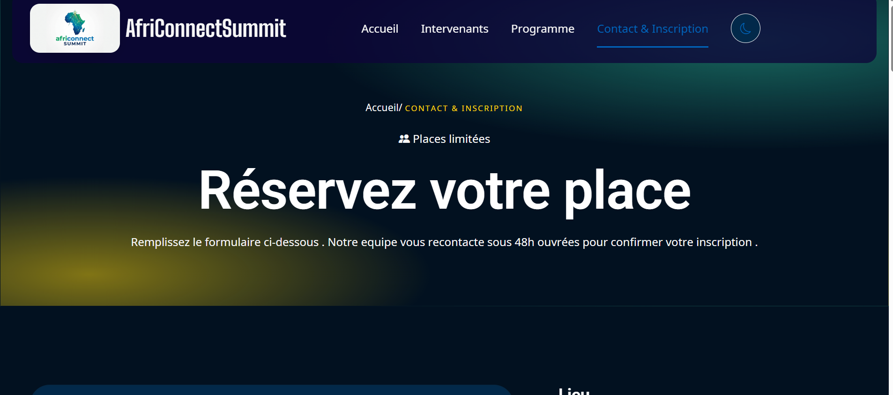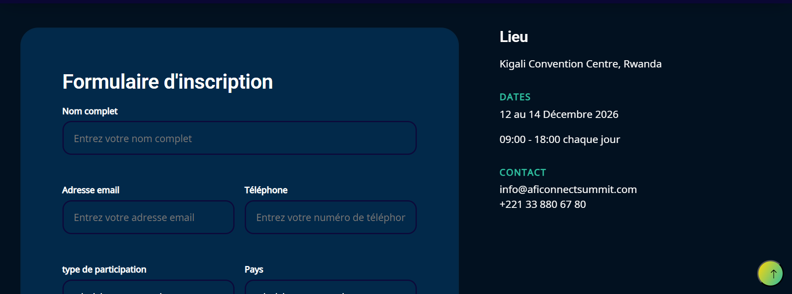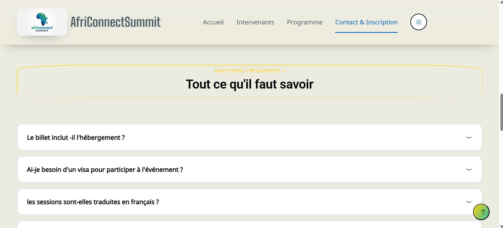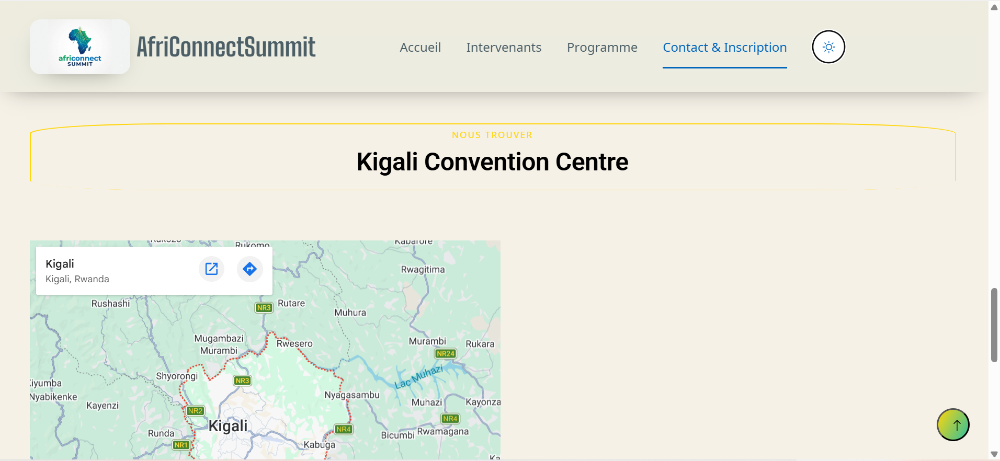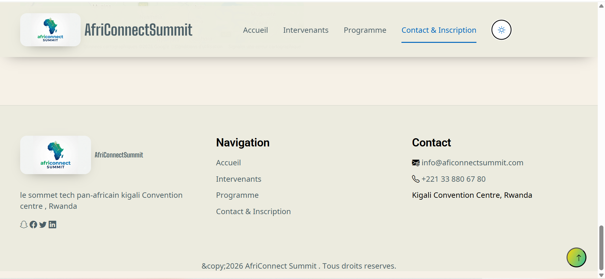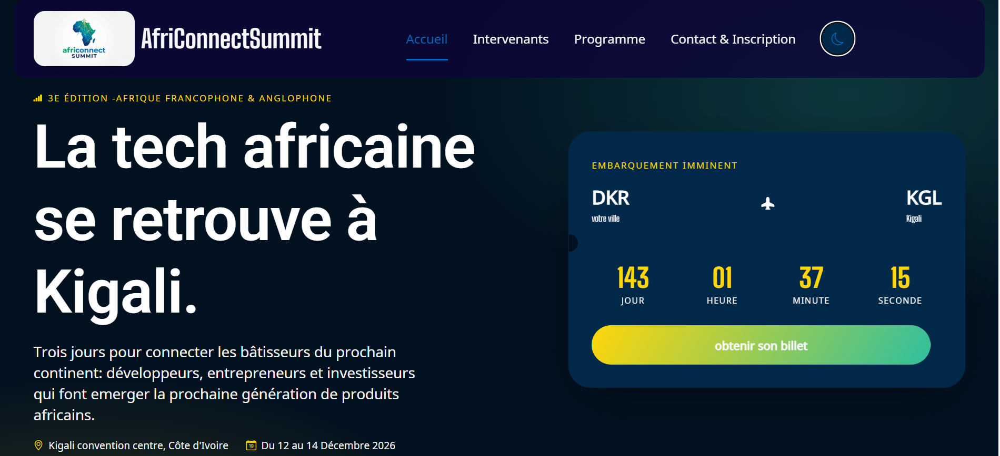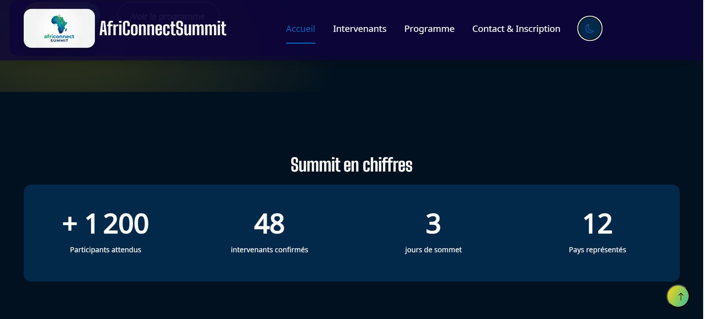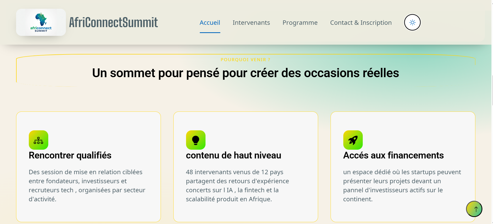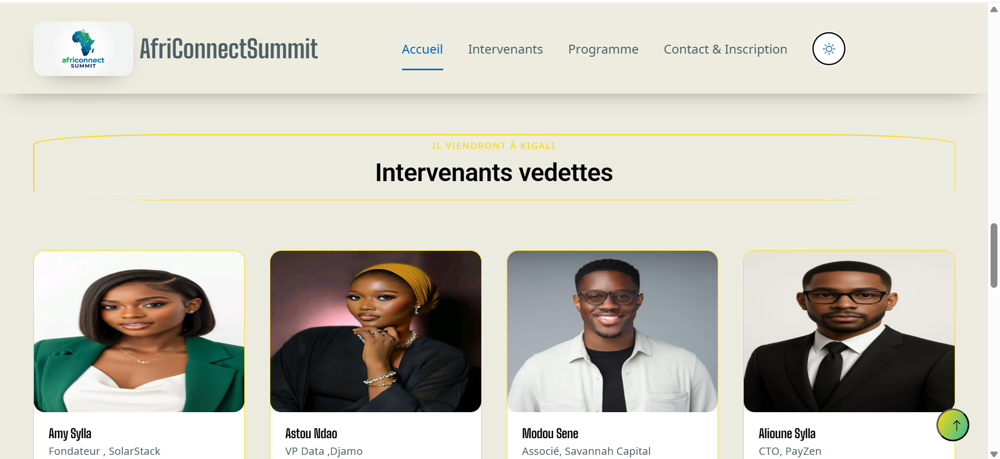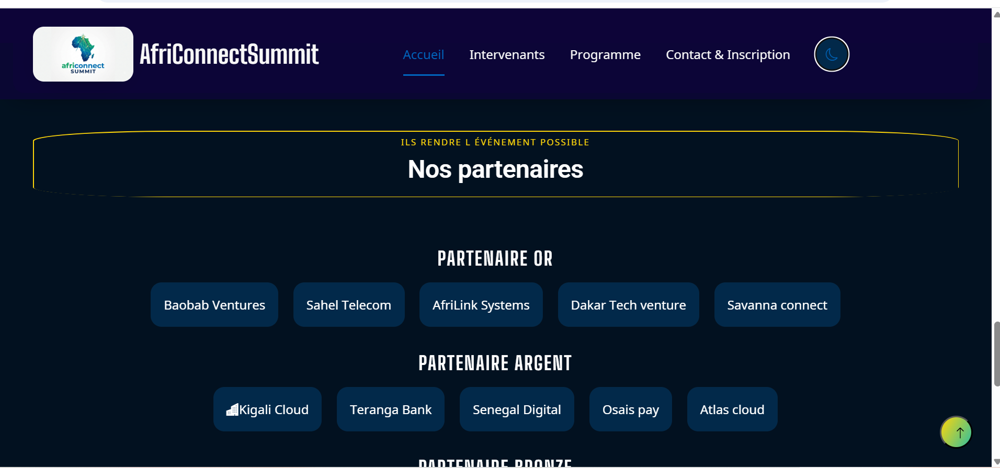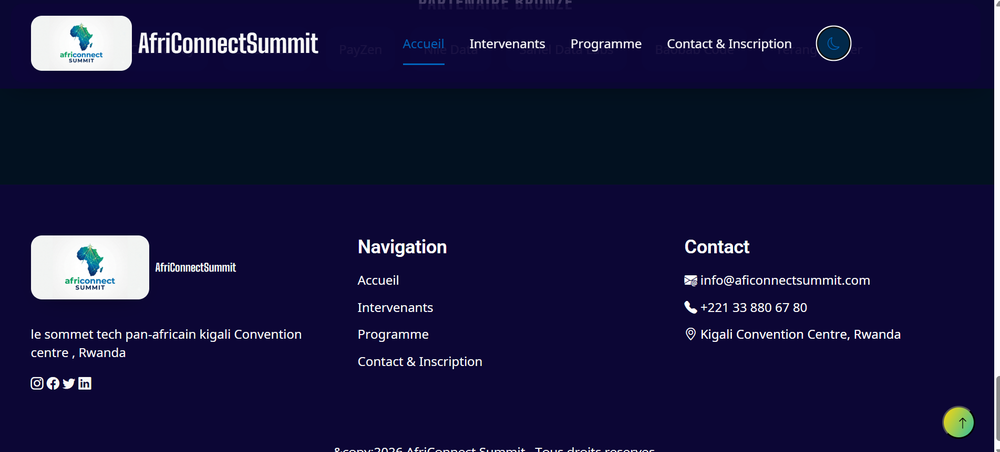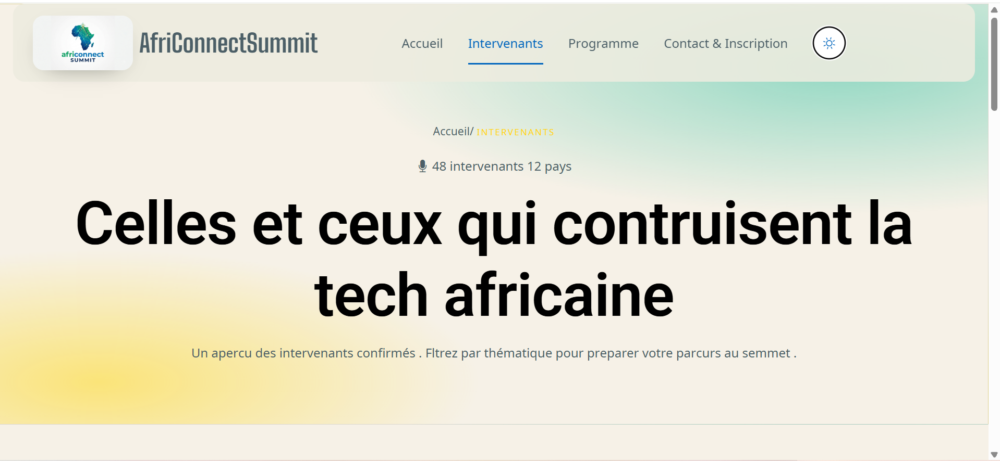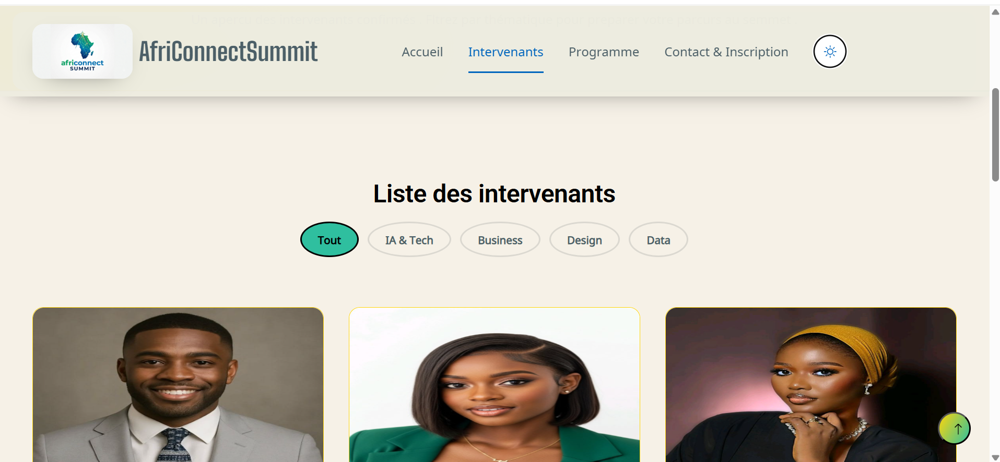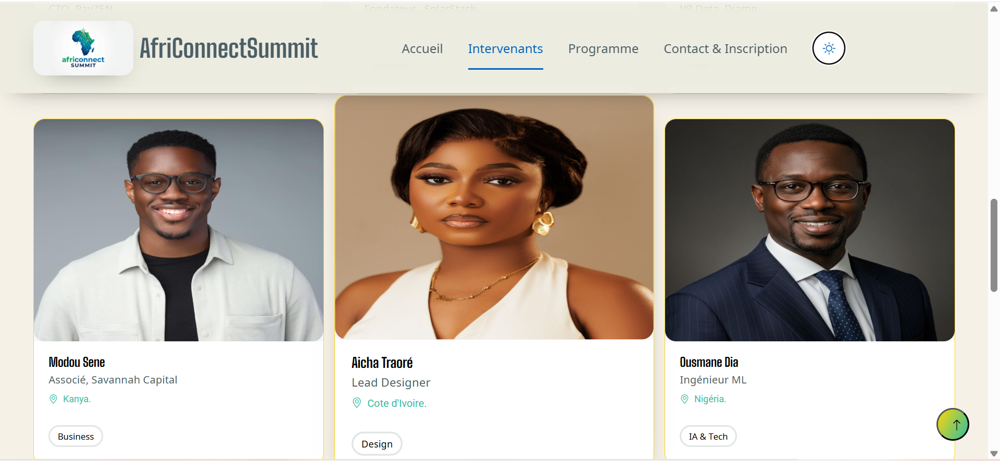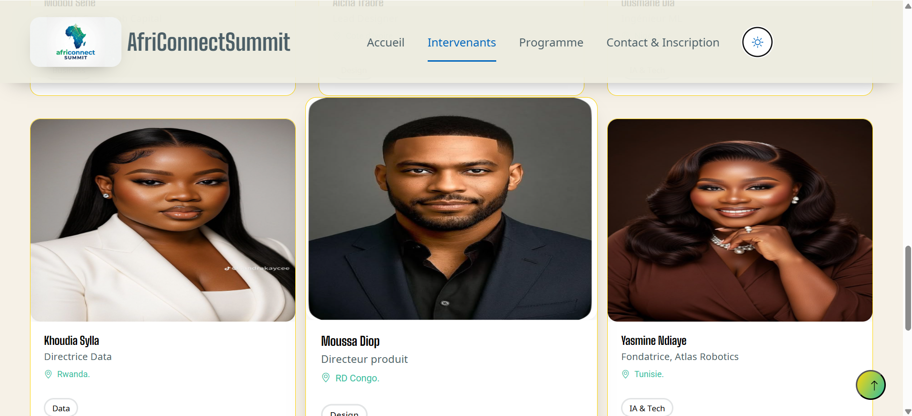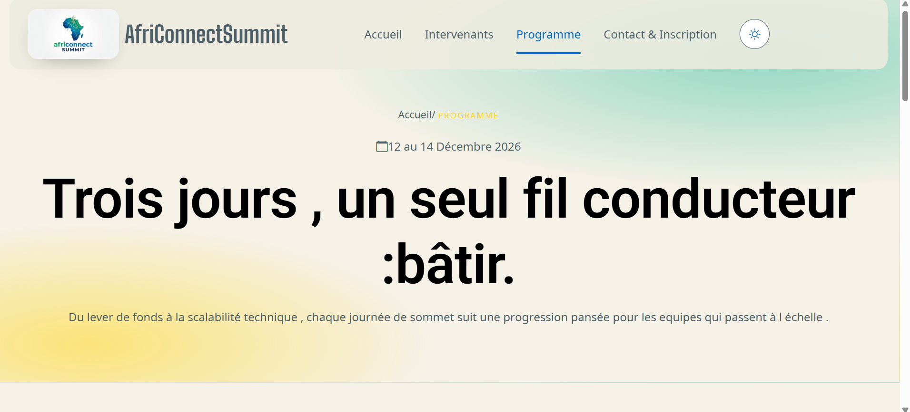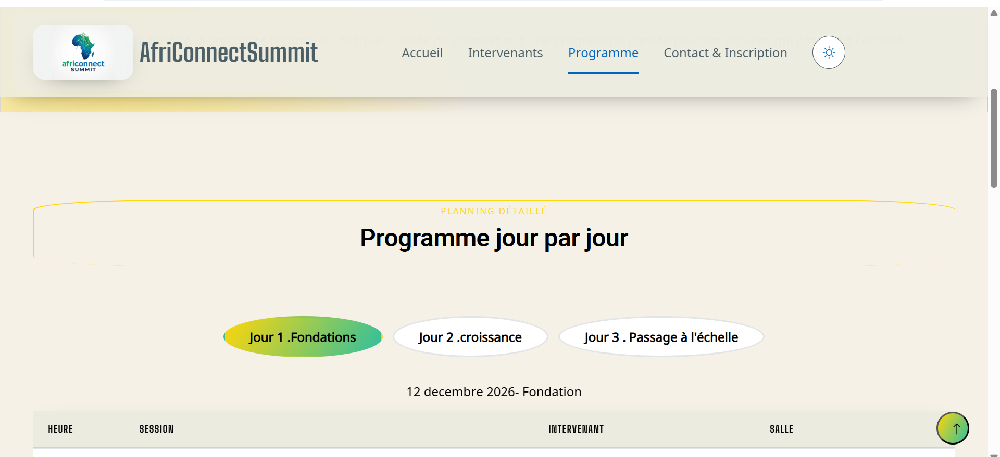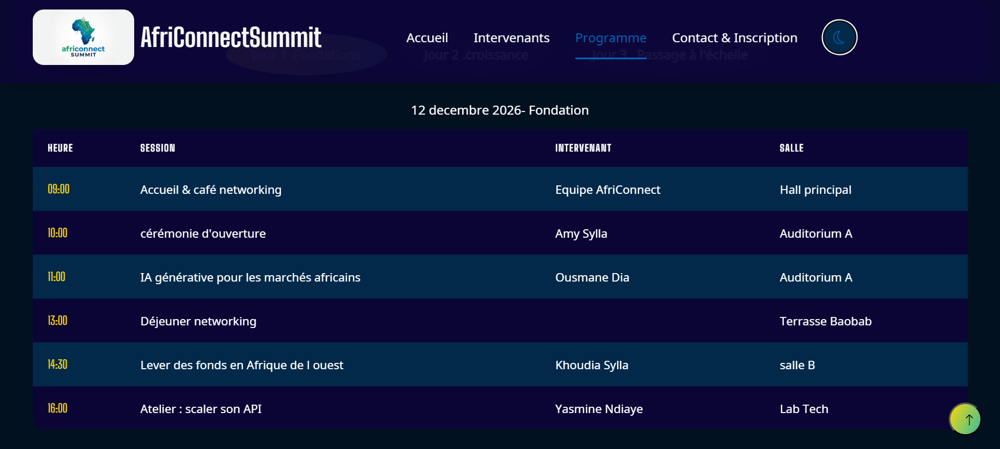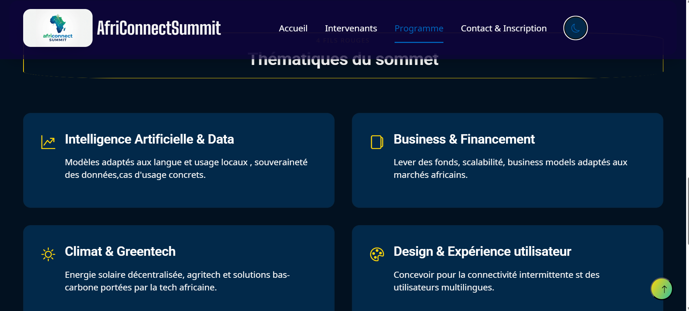